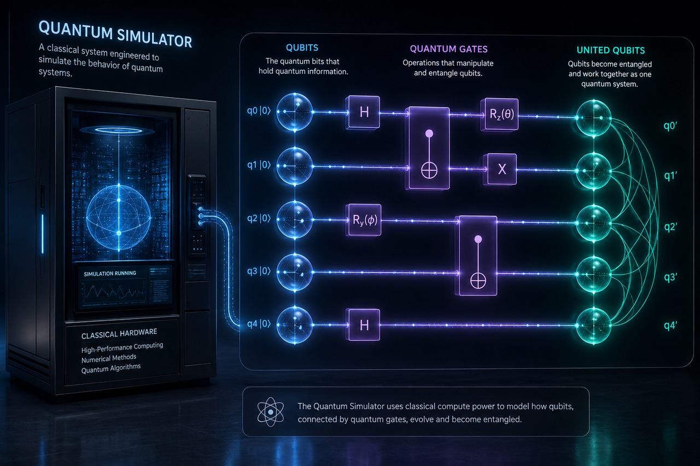

# Quantum Simulator

<p align="center">
  
</p>


> **Quantum computing from first principles.** Every gate, algorithm, and
> error-correction code built from scratch on NumPy — no Qiskit, no Cirq, no
> external quantum framework. Three simulation engines under one API, 74
> algorithms, and a suite validated on real IBM Quantum hardware.

## Highlights

- ⚛️ **Three engines, one API** — dense state-vector (universal, exact),
  tensor networks (MPS / DMRG / TEBD, scales with low entanglement), and the
  stabilizer formalism (~10,000 Clifford qubits).
- 🧮 **74 algorithms** — Grover, Shor, QFT, phase estimation, VQE, QAOA, HHL,
  QSVT, amplitude estimation, error mitigation, plus quantum ML (kernels, SVM,
  QCNN, autoencoders, RL).
- 🛡️ **Real error correction** — surface code with MWPM decoding, magic-state
  distillation, toric code, union-find decoder.
- 🔧 **Compilation toolchain** — Solovay–Kitaev, KAK decomposition, ZX-calculus,
  QASM import/export.
- 🔬 **Validated on hardware** — pre-registered experiments executed on IBM's
  `ibm_kingston` device, with raw results, under [`ibm_experiments/`](ibm_experiments/).
- 🧪 **2,191 tests** across the core, algorithms, tensor networks, and noise.
- 📦 **Tiny footprint** — pure NumPy + SciPy, `pip install` and go.

A single qubit is stored as four real numbers `[Re α, Im α, Re β, Im β]`,
making the amplitude/probability split explicit and the whole engine
transparent end to end.

## Install

```bash
git clone https://github.com/truegabe/Quantum-Simulator.git
cd Quantum-Simulator
pip install -r requirements.txt
# or, as an editable package:
pip install -e .
```

Requires Python 3.9+, NumPy, SciPy. (`matplotlib` optional, for Bloch-sphere / circuit visualisation.)

## Quickstart

```python
from qbit_simulator import QuantumCircuit, measure

# Bell state
qc = QuantumCircuit(2)
qc.h(0)
qc.cnot(0, 1)

print(qc.state)          # [0.707+0j, 0, 0, 0.707+0j]
print(measure(qc, shots=1000))   # ~50/50 over '00' and '11'
```

## What's inside

### Core engine
- **`qubit.py`** — single qubit; `gates.py` — H, X, Y, Z, S, T, CNOT and friends
- **`circuit.py`** — `QuantumCircuit` dense state-vector simulator
- **`measure.py` / `density.py`** — projective measurement, sampling, density matrices
- **`noise.py`** — Kraus channels: bit/phase flip, depolarizing, amplitude &
  phase damping, thermal relaxation, crosstalk, two-qubit depolarizing, plus
  trajectory simulation
- **`bloch.py`, `viz.py`, `circuit_render.py`** — visualisation

### Scaling engines (beyond the dense limit)
- **Tensor networks** — `mps`, `mpo`, `dmrg`, `tebd`, `peps`, `mera`, `vqe_mps`:
  represent large low-entanglement states compactly
- **Stabilizer formalism** — `stabilizer.py`: Clifford circuits in O(N²D),
  scaling to ~10,000 qubits (Clifford gate set only — not universal)
- **`lanczos.py`, `optimizers.py`** — sparse eigensolvers and variational
  optimisation backends

### Algorithms (`qbit_simulator/algorithms/`, ~74 modules)
Grover, Shor, QFT, quantum phase estimation (+ iterative), Deutsch–Jozsa,
teleportation, CHSH / Mermin–GHZ nonlocality, VQE (+ noisy, ADAPT, SSVQE),
QAOA, HHL, amplitude estimation, quantum counting, QSVT / QSP, LCU, block
encoding, Trotter–Suzuki, randomized benchmarking, classical shadows, error
mitigation (PEC / ZNE), random-circuit sampling, quantum volume, boson
sampling, QKD variants, MBQC, toric / Kitaev-honeycomb codes — plus quantum
machine learning: kernels, SVM, QCNN, autoencoder, RL, natural gradient.

### Error correction & compilation
- `qec`, `surface_mwpm`, `magic_state_distillation`, `toric_code`,
  `union_find_decoder`
- `solovay_kitaev`, `kak`, `zx_calculus`, `qasm` (import/export),
  `pauli_decomposition`

### Beyond qubits
- `qudit.py` (d-level systems), `fermion.py`, `bosonic.py`, `lindblad.py`
  (open-system dynamics), `pulse.py` (pulse-level control)

### Neuron models (`qbit_simulator/neurons/`, ~109 modules)
A separate library of classical and spiking neuron / learning models (LIF,
Izhikevich, Hodgkin–Huxley, STDP, Hopfield, predictive coding, reservoirs,
…) together with experimental **quantum-neuron bridges**
(`quantum_perceptron`, `quantum_boltzmann`, `quantum_reservoir`, …).

## Honest scaling limits

| Engine | Scales to | Restriction |
|---|---|---|
| Dense state-vector | ~28 qubits | universal, exact, but 2ⁿ memory |
| Stabilizer | ~10,000 qubits | Clifford gates only (no T) |
| Tensor networks (MPS/DMRG) | many qubits | only when entanglement is low; approximate otherwise |

There is no free lunch around the 2ⁿ wall — each engine trades something
(gate set, entanglement, or exactness) for reach.

## IBM hardware experiments

[`ibm_experiments/`](ibm_experiments/) contains pre-registered experiment
suites (GUBIT 10–13) executed on IBM Quantum hardware (`ibm_kingston`), with
their raw results. Each `*_IBM_Quantum_Results.md` documents the
pre-registration, the circuits run, and the measured outcomes — including
negative results where the hardware matched a noiseless classical simulator.
Read the docs for the full findings.

## Tests

```bash
pip install pytest
pytest tests/ -q
```

135 test modules cover the core, algorithms, tensor networks, error
correction, and noise channels.

## License

MIT — see [LICENSE](LICENSE).
